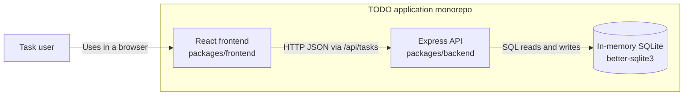
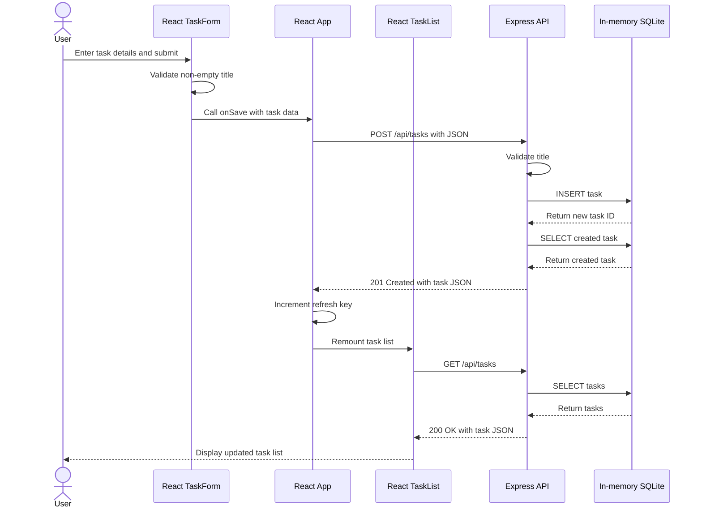

# Cloud Architecture Overview

The TODO application is a monorepo with a React browser client and an Express API. The API stores task data in an in-memory SQLite database provided by `better-sqlite3`.

## Context Notes

- The frontend uses the development proxy to send `/api/tasks` requests to the Express API.
- The Express API owns task validation and CRUD operations.
- The SQLite database runs in memory inside the backend process, so its data is not durable across process restarts.
- The current implementation does not use an external database or cloud-managed service.

## Create a TODO Sequence

